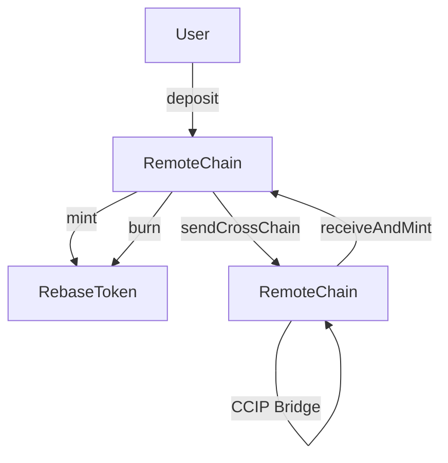

# Cross-Chain Rebase Token System

This project implements a modular cross-chain rebase token system built in Solidity. It includes three main smart contracts:

- **RebaseToken** – An ERC20-compatible interest-bearing rebase token with controlled minting and burning.
- **RebaseTokenPool** – A CCIP-enabled pool contract to bridge tokens across chains with supply synchronization.
- **Vault** – A mint/burn gateway managing user balances and interacting with the token contract.

---

## Architecture Overview



The architecture separates the token logic, supply minting gateway, and cross-chain bridging mechanisms to ensure modularity and security.

---

## _Contracts_

### RebaseToken.sol

- Based on `ERC20`.
- Mint/burn controlled by authorized `minters`.
- Uses `MAX_SUPPLY` and `rebaseMultiplier` for global rebasing logic.
- Token is rebased implicitly via adjusted balances (no looping over holders).

### RebaseTokenPool.sol

- Bridges tokens across chains via [Chainlink CCIP](https://chain.link/cross-chain).
- Handles token supply synchronization during bridging.
- Configurable with remote pool and Vault addresses.

### Vault.sol

- Acts as the minter/burner interface for RebaseToken.
- Manages internal accounting and user interactions.
- Sends bridged tokens via `sendCrossChain` using the associated pool.
- Receives bridged tokens and mints them to destination users.

---

## Deployment & Configuration

Deployment is managed via Foundry scripts (`.s.sol`), including:

### Step 1: Deploy RebaseToken

```bash
forge script script/DeployRebaseToken.s.sol:DeployRebaseToken --broadcast --rpc-url <CHAIN_RPC>
```

### Step 2: Deploy RebaseTokenPool

```bash
forge script script/DeployRebaseTokenPool.s.sol:DeployRebaseTokenPool --broadcast --rpc-url <CHAIN_RPC>
```

### Step 3: Deploy Vault

```bash
forge script script/DeployVault.s.sol:DeployVault --broadcast --rpc-url <CHAIN_RPC>
```

### Step 4: Configure Cross-Chain Routing

Configure the pool with remote pool and vault:

```bash
forge script script/ConfigurePool.s.sol:ConfigurePool --broadcast --rpc-url <CHAIN_RPC>
```

### Step 5: Bridge Tokens

To initiate a cross-chain bridge operation:

```bash
forge script script/BridgeTokens.s.sol:BridgeTokens --broadcast --rpc-url <CHAIN_RPC>
```

---

## Access Control

- `RebaseToken`: only `minters` can mint/burn.
- `Vault`: must be a minter in RebaseToken and whitelisted in the pool.
- `RebaseTokenPool`: configured with trusted remote pool & vault.

---

## Testing (Coming Soon)

Foundry-based invariant and unit tests will be provided to validate:

- Cross-chain mint/burn invariants
- Supply consistency
- Rebase mechanics under edge cases

Test contracts will be located in `test/` folder.

---

## Security Considerations

- Make sure only trusted vaults are added to pools.
- Admin roles must be protected via timelock or multi-sig.
- Chainlink CCIP must be configured with correct chain selectors.

---

## License

MIT License
